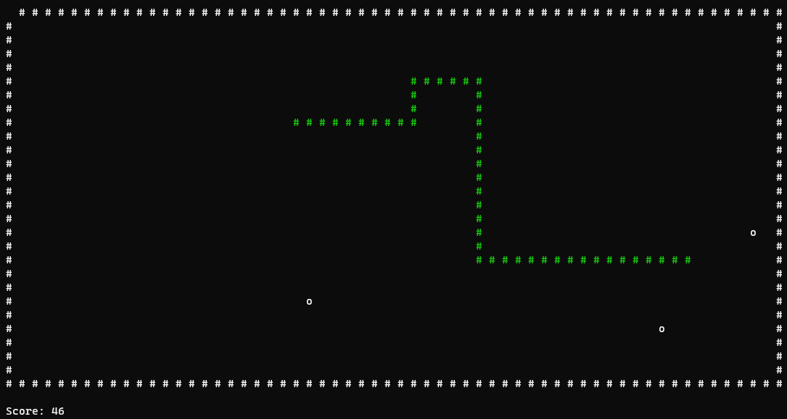

# Retro Snake



Retro Snake is a remake of the classic snake game that brings the nostalgia of the legendary Snake back to life. Navigate a snake through the playing field, collect food to grow, and avoid collisions. It's a simple yet addictive game.

## Features

- Classic Snake gameplay.
- Simple controls.
- Collect food to grow the snake.
- Avoid collisions with yourself.
- Challenge yourself to achieve the highest score.

## Getting Started

1. Clone the repository:

   ```bash
   git clone https://github.com/chFleschutz/retro-snake.git
   ```

2. Open the Visual Studio Solution.

3. Run the project and have fun!

# How to Play

1. Launch the game and press any key to start.
2. Control the snake's direction using the WASD-keys.
3. Collect the food items that appear on the screen to make the snake grow longer.
4. Avoid running into yourself to stay alive.
5. Aim to achieve the highest score by collecting as much food as possible and growing the snake.
